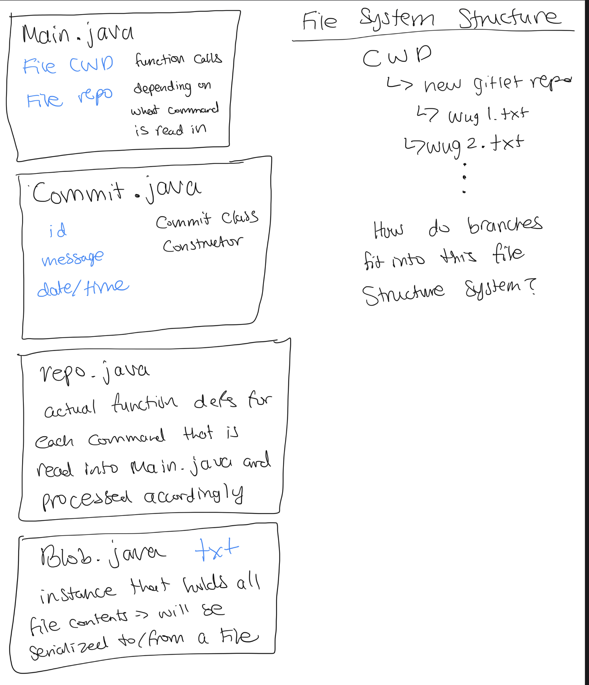
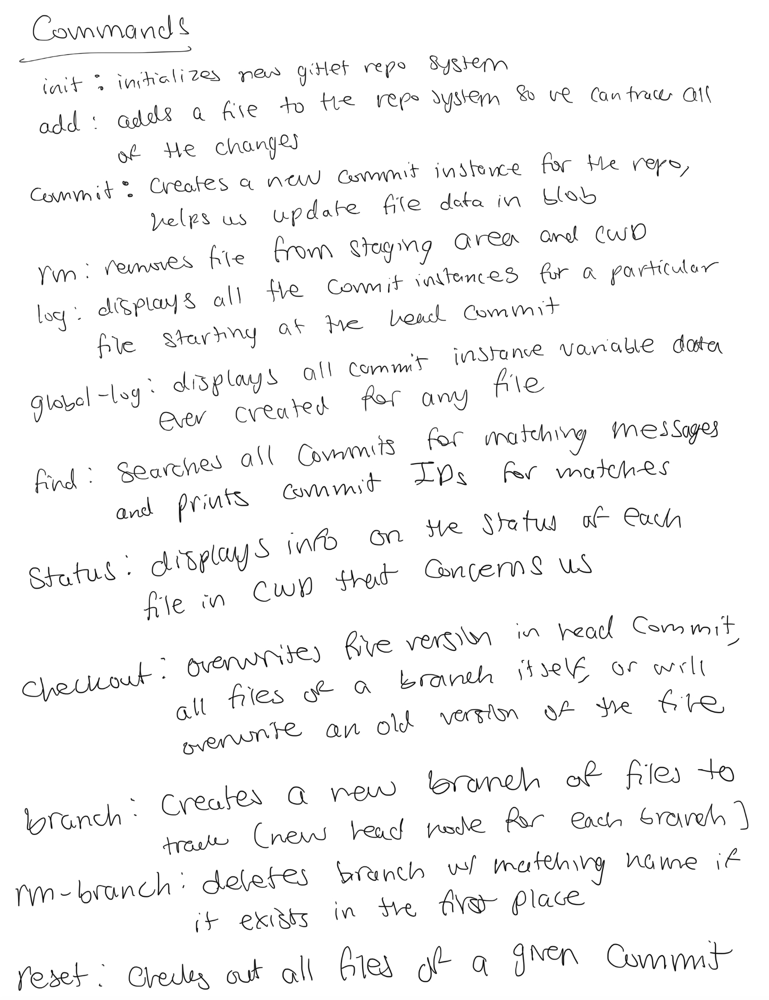

# Gitlet Design Document
author: Megan Mehta

last updated: 2022/04/28

## 1. Classes and Data Structures

### Main.java
This class is the entry point of the program, and it implements methods to set up persistence and calls functions that pull the entire program together
- Reads in command line args and calls functions for each command

#### Fields:
1. static final CWD: A pointer to the current working directory of the program
2. gitletRepo object: object for repo class so we can call functions for each command

### Commit.java
This class holds all the data related to creating a commit for each file 
- Stores data about commit messages, date/time, and blobs (actual contents of the file)

####Fields:
1. String msg: stores commit message
2. String timestamp: stores timestamp for commit
3. String mySHA: stores SHA id for commit
4. String parentSHA: stores SHA for previous commit (acts as a pointer to previous commit)
5. HashMap<String, String> blob: hashmap for blobs with its fileName and SHA
6. static final CWD: A pointer to the current working directory of the program

### Stage.java
Creates a staging area for the files in gitlet

####Fields:
1. HashMap<String, String> addedFiles: holds the fileName and SHA for blobs we want to add to stage for commiting
2. HashMap<String, String> removedFiles: holds the fileName and SHA for blobs we want to remove in stage for commit

### gitletRepo.java
Represents a gitlet object (.gitlet directory)
- Uses Commits, Stage, and Gitlet object to organize data on trees and commits

#### Fields:
1. String HEAD: holds SHA for latest commit
2. String branchName: holds "master" constant branchName
3. Stage stage = creates a staging area for files
4. File CWD: current working directory
5. HashMap<String, String> branchMap: stores branchName and commitID (commit SHA) for latest commit in that branch

### DumpObj.java
- Deserializes an file object and dumps its contents
- Part of the skeleton code

### Diff.java
This class helps us compare the contents of two files.
- Converts one sequence of edits to the next by determining similarities of strings
- Part of the skeleton code
____

## 2. Algorithms

### Main.java
- Only has function calls (for each command specified) for the gitletRepo object

### gitletRepo.java
#### Methods:
##### init()
- Entry point of program
- Initializes a new gitlet repo system in CWD
- creates initialCommit, updates the branchMap, and HEAD

##### add(String fileName)
- if file with fileName exists, it'll create a SHA for the contents of that file
  - creates a blobSHA
- adds this fileName and blobSHA to addedFiles
- removes from staging area if blobSHA is the same
- serializes stage object to stagePath

##### commit(String msg)
- if staging area is empty, prints message saying there's nothing to commit
- if msg is blank, asks user for a commit message
- if stuff to stage and have msg, create a copy of latest commit blobs, 
    add all fileNames and blobSHAs from staging area to blobCopies
- clears staging area
- creates new commit node with blobCopies, updates HEAD and branchMap
- serializes commit object in commit path where commitName is commitSHA

##### remove(String fileName)
- 
##### log()
- gets latest commit, prints it's info, and cycles backward (towards parent) till initial commit using 

##### globalLog()
- prints info for all commits ever created (serialized) in commitPath

##### find(String )

4. rm(String fileName): if `fileName` exists and is staged for addition, stages it for removal and removes it from the directory
7. find(String message): prints the SHAs of any commits that have a commit message that matches `message`
8. status(): displays which branch we're on, files staged, removed, modified, and untracked
9. checkout (3 different versions)
   1. checkout(String fileName): overwrites the version of the file as it exists in the head commit
   2. checkout(Commit id, String fileName): overwrites a file with matching commit ids with the file with fileName
   3. checkout(String branchName): takes all files in the commit of the head of a branch and puts them in the CWD even if it means overwriting existing versions of said files
10. branch(String branchName): creates a new branch with the given name and points it at the current branch
11. rm-branch(String branchName): deletes the branch specified by `branchName` if it exists
12. reset(Commit id): calls checkout method because it checks out all files tracked with matching commit id
13. merge(String branchName): merge files from given branch into current branch

------

## 3. Persistence
Lab Instructions: 

Describe your strategy for ensuring that you don’t lose the state of your program
across multiple runs. Here are some tips for writing this section:

* This section should be structured as a list of all the times you
  will need to record the state of the program or files. For each
  case, you must prove that your design ensures correct behavior. For
  example, explain how you intend to make sure that after we call
       `java gitlet.Main add wug.txt`,
  on the next execution of
       `java gitlet.Main commit -m “modify wug.txt”`, 
  the correct commit will be made.
  
* A good strategy for reasoning about persistence is to identify which
  pieces of data are needed across multiple calls to Gitlet. Then,
  prove that the data remains consistent for all future calls.
  
* This section should also include a description of your .gitlet
  directory and any files or subdirectories you intend on including
  there.

** we need to serialize/deserialze commit objects with blob data in the repo structure we designed
### gitlet.init:
- creates a new repo structure 

### gitlet.add [fileName]
- adds a file with fileName to the project structure 

### gitlet.commit [message]
- creates a new commit instance with the specified message for the file in CWD

### gitlet.rm [fileName]
- removes the file from the staging area and from the CWD

### gitlet.branch [branchName]
- creates a new branch with `branchName` if it doesn't already exist yet

-----

## 4. Design Diagram
Lab Instructions:

Attach a picture of your design diagram illustrating the structure of your
classes and data structures. The design diagram should make it easy to 
visualize the structure and workflow of your program.

